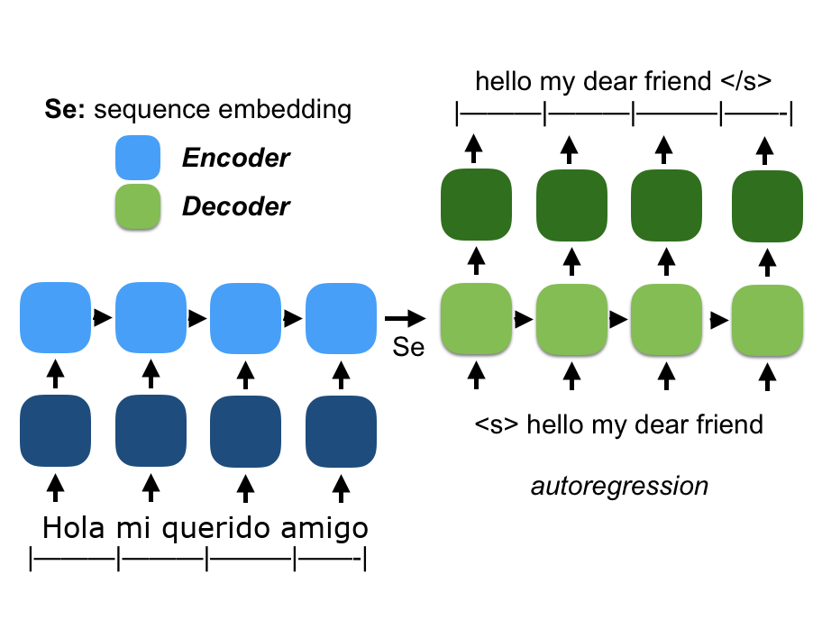
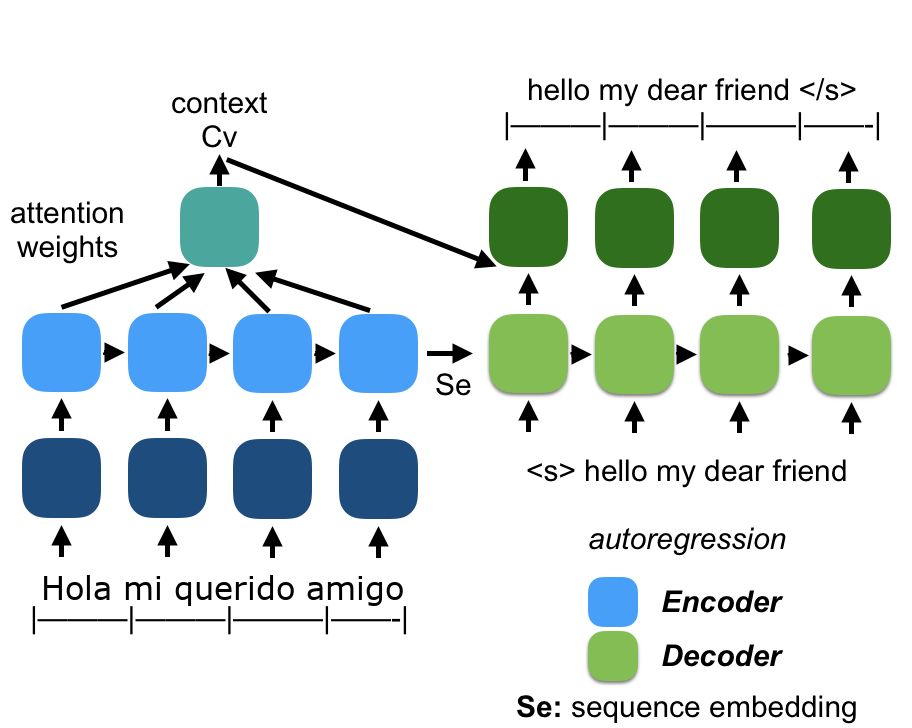
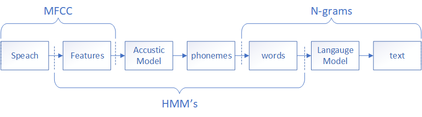
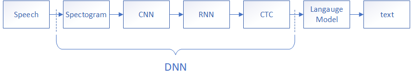

# Udacity Natural Language Processing Nanodegree and beyond...

I find Language Processing Nanodegree really exiting, and I took the [Udacity NLP Nanodegree](https://www.udacity.com/course/natural-language-processing-nanodegree--nd892) to get some of the basic concepts right, and to get a good baseline for further learning.

This repo contains the projects that is part of the course, and I have also gathered some good references.

The content of this repo is for my own reference, and for anyone that is interested in trying out solving some of the NLP problems, i especially found the **Machine Translation** and **Speach Recognition** interesting.

## Getting Started

All projects in this repo is done in Python using TensorFlow and Keras. you should be able to run all the projects on your local laptop.
The folders are prefixed with a number that reflects the order they were presented in the nanodegree and in this readme.

## 1. Part of Speech Tagging
The words that make up a language can be divided up in a number of classes. examples of classes are Noun, Verb, Adjective,... The classes differ from language to language. in English it is common to use eight or nine POS classes.
A brief intro in on [Wikipedia](https://en.wikipedia.org/wiki/Part_of_speech) and a more in depth explanation have a look at the [book](https://web.stanford.edu/~jurafsky/slp3/) on Speech and Language Processing by Daniel Jurafsky and James H. Martin.

### Part of Speech Tagging project
The project uses [Hidden Markov Model](https://en.wikipedia.org/wiki/Hidden_Markov_model) to learn POS tagging from a tagged dataset  
The project is found [here](https://github.com/udacity/hmm-tagger) and you can see my solution [here](./1-hmm-tagger)

## 2. Machine Translation
Translating from language to another is a quit complicated task to get right. To be able to do it well the model need to understand each word in the context of the sentence.
Neural networks have been shown to be able to learn to do language translation, using Recurrent neural network (RNN) in a Sequence-to-Sequence configuration

This kind of Deep Neural Networks showed good capabilities but showed one major problem when translating long sentences. The whole sentence is transformed into one hidden state (Se), before translated to the new language, and the hidden state is therefore a bottleneck limiting the information that can be carried from the encoder to the decoder. One solution is to increase the size of the hidden state, however this causes overfitting on shorter sentences.

[A ten-minute introduction to sequence-to-sequence learning in Keras](https://blog.keras.io/a-ten-minute-introduction-to-sequence-to-sequence-learning-in-keras.html)

### Attention
Attention has become such an important part of NLP and has also shown some interesting usages in other areas.
it was first described in 2014 by Dzmitry Bahdanau's paper [Neural Machine Translation by Jointly Learning to Align and Translate](https://arxiv.org/abs/1409.0473) and extended in 2015 by Thang Lung's paper [Effective Approaches to Attention-based Neural Machine Translation](https://arxiv.org/abs/1508.04025), the fist is commonly referenced to as Additive or Bahdanau Attention and the last as Multiplicative  or Luong Attention. multiplicative attention is the one commonly used as it is faster and more space-efficient in practice as it can be implemented more efficiently using matrix multiplication

One of the best known Machine Translation systems is properly Google Translate, in 2016 they released this paper [Google’s Neural Machine Translation System: Bridging the Gap between Human and Machine Translation](https://arxiv.org/pdf/1609.08144.pdf) explaining how they use Deep Learning with LSTM RNN and Attention.

The use of Attention showed to be really effective, as the model can now learn what information is important to pass from the encoder to the decoder at each step of the decoding

When the model is trained, the attention weights between the words in the input and output can be displayed, showing that the attention mechanism focuses on the relevant input words when predicting the output word

Tensorflow Seq-to-Seq example using attention for translation is found here: [Neural machine translation with attention](https://www.tensorflow.org/tutorials/text/nmt_with_attention)

### Transformer
Since the first two paper a lot of work has been done using Attention, one of the important papers are [Attention Is All You Need](https://arxiv.org/abs/1706.03762), This paper shows how it is possible to do Seq-to-Seq without running the input and output through an RNN, this model is called "The Transformer".
The Transformer has shown to give better performance, while being faster to train.
explanation can be found in this video [Attention is all you need; Attentional Neural Network Models | Łukasz Kaiser | Masterclass](https://www.youtube.com/watch?v=rBCqOTEfxvg)

Tensorflow transformer example for translation is found here: [Transformer model for language understanding](https://www.tensorflow.org/tutorials/text/transformer)

### Machine Translation Project
The project implements a Sequence-to-Sequence model that translates from English to French.
The project on Machine translation is found [here](https://github.com/udacity/aind2-nlp-capstone) and you can see my solution [here](./2-aind2-nlp-capstone)
Examples:
"he saw an old yellow truck" --> "il a vu un vieux camion jaune"
"new jersey is sometimes quiet during autumn , and it is snowy in april ." --> "new jersey est parfois calme pendant l' automne et il est neigeux en avril"

## 3. Automatic Speech recognition (ASR)
Speech recognition or speech-to-text is the process of converting the sound waves generated by someone speaking into text.
This is a process that is totally natural to us as humans but is complicated for machines.

Speech Recognition is used in digital assistants like Alexa, Siri and Google Assistant, translating the voice into text is the first part of the process, that is followed by understanding, and answer generation and then finally Text-to-Speech

### Classical Speech Recognition
When starting to analyze speech the human anatomy can work as a guide to how the sound recording can be preprocessed to reduce the dimensions, reduce noise while keeping the important information.  
**The ear** The MEL Scale was developed to represent what frequencies we as a human can hear and distinguish from each other. using this information it is possible to reduce the number of frequencies, and thereby the dimensions of our data.  
**The voice making mechanism** is our vocal cord and the cepstral, we all have unique voices, that differ in frequency, but how we use the cepstral is more ore less the same when generating the sounds that make up speech. Cepstral Analysis focuses on extracting the part of the speech that is common and filtering out the unique difference that is from person to person.

Combining Cepstral Analysis and MEL Frequency Analysis gives 12-13 MFCC Features that are useful for Speech Recognition.

Mapping sound directly to words are not as straight forward as you might think, the same letter used in different sentences has different sounds. The different sounds that make up the language is described with Phonemes. US English has 39-44 Phonemes.
Speech Recognition can be designed both to map directly to words, or to phonemes, systems that map to phonemes use a dictionary to further map the phonemes to words.

### Speech Recognition using Deep Neural Networks
A lot of work has gone into developing and refining the classical ASR pipeline, but with Deep Neural Network a end-to-end approach has shown to be effective.
Going from the spectrogram of the speech to useful features could be done by MFCC, but the filtering could also be done using CNN's. When presented with enough examples an layered CNN should pick up relevant features.

One problem that the classical model solves using a HMM is that the speed of a word can vary. A RNN is providing an output for each time step, and therefor if not handled it would duplicate letters if a sentence is spoken slowly. In Deep Learning approach this is handled using Connectionist Temporal Classification (CTC) [Graves, Alex, et al. "Connectionist temporal classification: labelling unsegmented sequence data with recurrent neural networks." Proceedings of the 23rd international conference on Machine learning. ACM, 2006.](https://www.cs.toronto.edu/~graves/icml_2006.pdf). 

The DNN approach can take the raw spectrogram and run it through CNN and RNN layers, and finally get a perdition of the text using CTC scoring. The course project uses this approach, and you can see how this can be done here [here](https://github.com/udacity/AIND-VUI-Capstone).
It is possible to add a language model to the pipeline and further improve the accuracy, this model can be trained on large quantities of text.

### References

**Deep Speech 2**
- [Amodei, Dario, et al. "Deep speech 2: End-to-end speech recognition in english and mandarin." International Conference on Machine Learning. 2016.](https://arxiv.org/pdf/1512.02595v1.pdf)
- [Presentation](https://www.youtube.com/watch?v=g-sndkf7mCs)
- [Slides](https://cs.stanford.edu/~acoates/ba_dls_speech2016.pdf)

**Language modeling with CTC**

Gram-CTC from Baidu on integrating a language model into CTC for better performance:
- [Liu, Hairong, et al. "Gram-CTC: Automatic Unit Selection and Target Decomposition for Sequence Labelling." arXiv preprint arXiv:1703.00096 (2017).](https://arxiv.org/pdf/1703.00096.pdf)

Language modeling with CTC based on weighted finite-state transducers (WFSTs):
- [Miao, Yajie, Mohammad Gowayyed, and Florian Metze. "EESEN: End-to-end speech recognition using deep RNN models and WFST-based decoding."](https://arxiv.org/pdf/1507.08240.pdf)

### Machine Translation Project
The project uses the [LibriSpeech ASR corpus](http://www.openslr.org/12/) to learn to convert English speech into text.
The model is a CNN+RNN model that uses CTC as explained in the diagram above, a language model is not use, but could be added to furter improve the results.

The project on Machine translation is found [here](https://github.com/udacity/AIND-VUI-Capstone) and you can see my solution [here](./3-AIND-VUI-Capstone)